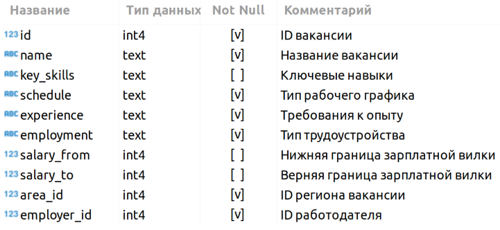
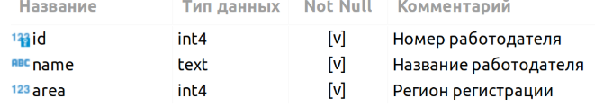
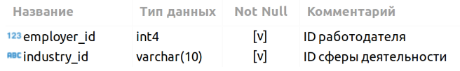

# Project-2. Анализ вакансий Headhunter с использованием поисковых запросов SQL

## **Описание проекта**
В нашем распоряжении база резюме от работодателей, выгруженная с сайта поиска вакансий *hh.ru*.
База данных с исходными данными о резюме работодателей находится в табличном виде в Metabase.
Все запросы написаны на SQL.

## **Описание задачи:**
Компания *HeadHunter* хочет построить модель, которая бы автоматически определяла примерный уровень заработной платы, подходящей пользователю, исходя из информации, которую он указал о себе. Для постройки этой модели в будущем нам необходимо исследовать, преобразовать и очистить данные.

## **Что практикуем**
- Получение нужных данные с помощью SQL-запросов;
- Исследование первичной информацию;
- Проведение анализа данных;
- Фильтрацию полученных данных;
- Делать взвешенные выводы.

## **Структура данных**
- Таблица **vacancies** 
Хранит в себе данные по вакансиям и содержит следующие столбцы:

*Зарплатная вилка — это верхняя и нижняя граница оплаты труда в рублях (зарплаты в других валютах уже переведены в рубли). Соискателям она показывает, в каком диапазоне компания готова платить сотруднику на этой должности.*

- Таблица **areas** 
Справочник, которая хранит код региона и его название.

- Таблица **employers** 
Справочник со списком работодателей.

- Таблица **industries**
Справочник вариантов сфер деятельности работодателей.

- Таблица **employers_industries**
Дополнительная таблица, которая существует для организации связи между работодателями и сферами их деятельности.

*Эта таблица нужна нам, поскольку у одного работодателя может быть несколько сфер деятельности (или работодатели могут вовсе не указать их). Для удобства анализа необходимо хранить запись по каждой сфере каждого работодателя в отдельной строке таблицы.*

## Этапы работы над проектом
1. Знакомство с данными;
2. Предварительный анализ данных;
3. Детальный анализ вакансий;
4. Анализ работодателей;
5. Предметный анализ.
6. Заключение

## Результаты
Подытожив все исследования можно сделать общие выводы:

      Общий анализ вакансий
      - Больше всего вакансий размещены в крупных городах;
      - Примерно в половине вакансий указан размер оплаты труда;
      - Самые распространенный график работы - "Полный день и полная занятость". Второе место занимает "Удалённая работа и полная занятость";
      - Больше всего вакансий предлагается специалистам с опытом от 1 года до 3 лет.
      
      Общий анализ вакансий
      - Больше всего вакансий размещают крупные компании из России, преимущественно в крупных городах;
      - Больше трети компаний не имеет определённой сферы деятельности;
      - Примерно 15% компаний занимаются "Разработкой программного обспечения";
      
      Общий анализ вакансий
      - Среди 1771 вакансий, относящихся к DS, для начинающих специалистов доступна только 51 вакансия;
      - Из наиболее популярных ключевых навыков можно выделить Python и SQL;
      - В среднем специалисту DS нужно обладать 6 ключевыми навыками;
      - Средняя зарплата специалиста DS - около 180тыс. и напрямую зависит от опыта.

Учитывая вышеизложенное можно вывести следующее:
- Не смотря на то, что специальность DS не является самой популярной (исходя из предоставленных данных), вакансий достаточно как для новичков, так и для соискателей с опытом. Наличие хотя бы одного года работы уже значительно увеличивает число вакансий DS.
- Распределение вакансий по регионам довольно прозрачное: лучше всего искать работу в Москве или других крупных городах (также стоит рассмотреть популярные места релокации - например страны СНГ). Вакансии с возможностью удаленной работы составляют всего 6,5% от общего числа. На текущий момент времени сложно предположить, будет ли расти процент вакансий с удаленной работой.
